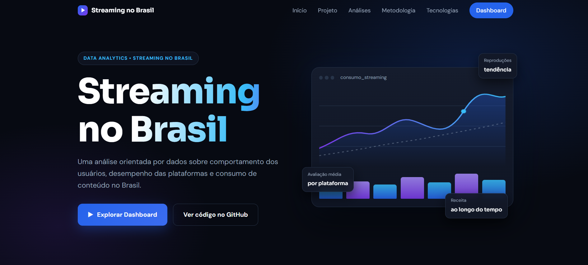
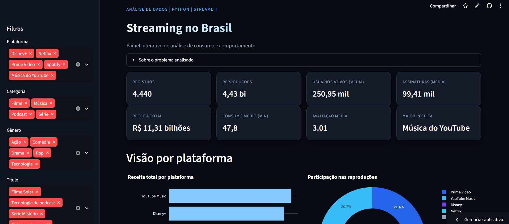

> **Disciplina:** LINGUAGENS DE PROGRAMAÇÃO

> **Professor:** Alexandre Neves Louzada

> **Aluno:** Igor Batista Pereira

# Streaming Brasil Analytics - Site

Landing page do projeto acadêmico **Streaming Brasil Analytics**, desenvolvido para apresentar uma análise de dados sobre plataformas de streaming no Brasil.

A página apresenta o contexto do projeto, as principais análises e a metodologia utilizada, além de direcionar para o dashboard interativo e o repositório principal.


---

## 🖥️ Preview

### Landing Page

<a href="https://igorbatistapdev.github.io/streaming-analytics-site/">
  
</a>

👉 **Clique na imagem para acessar o site**

### Dashboard Interativo

<a href="https://dashboard-streaming.streamlit.app/">
  
</a>

👉 **Clique na imagem para acessar o dashboard**

---

## 📌 Sobre o projeto

O **Streaming Brasil Analytics** é um projeto acadêmico voltado à análise e visualização de dados relacionados ao consumo de plataformas de streaming no Brasil.

A solução utiliza técnicas de análise de dados para explorar informações sobre plataformas, categorias, gêneros, reproduções, usuários, assinaturas, receita, consumo e avaliações.

A base de dados utilizada é **simulada e destinada exclusivamente ao uso acadêmico**.

Este repositório contém exclusivamente a **landing page de apresentação**. O dashboard interativo é desenvolvido separadamente utilizando Python e Streamlit.

---

## 🛠️ Tecnologias

- HTML5
- CSS3
- JavaScript (Vanilla)
- SVG
- Google Fonts

O projeto não utiliza frameworks ou etapa de build.

---

## 🎨 Interface

A página foi desenvolvida com foco em uma apresentação moderna, objetiva e responsiva do projeto.

Principais características:

- Design responsivo;
- Tema escuro;
- Detalhes em azul, ciano e violeta;
- Animações e efeitos de interação;
- Navegação adaptada para dispositivos móveis;
- Seção de apresentação do projeto;
- Apresentação das principais análises;
- Indicadores e metodologia;
- Acesso direto ao dashboard interativo.

---

## 📂 Estrutura

```text
.
├── index.html
├── style.css
├── script.js
└── image/
    ├── favicon.png
    ├── site-streaming.png
    └── dashboard.png
